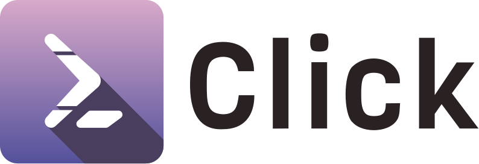

.. rst-class:: hide-header

Welcome to Click
================

Click is a Python package for creating beautiful command line interfaces
in a composable way with as little code as necessary.  It's the "Command
Line Interface Creation Kit".  It's highly configurable but comes with
sensible defaults out of the box.

It aims to make the process of writing command line tools quick and fun
while also preventing any frustration caused by the inability to implement
an intended CLI API.

Click in three points:

-   arbitrary nesting of commands
-   automatic help page generation
-   supports lazy loading of subcommands at runtime

What does it look like?  Here is an example of a simple Click program:

.. click:example::

    import click

    @click.command()
    @click.option('--count', default=1, help='Number of greetings.')
    @click.option('--name', prompt='Your name',
                  help='The person to greet.')
    def hello(count, name):
        """Simple program that greets NAME for a total of COUNT times."""
        for x in range(count):
            click.echo(f"Hello {name}!")

    if __name__ == '__main__':
        hello()

And what it looks like when run:

.. click:run::

    invoke(hello, ['--count=3'], prog_name='python hello.py', input='John\n')

It automatically generates nicely formatted help pages:

.. click:run::

    invoke(hello, ['--help'], prog_name='python hello.py')

You can get the library directly from PyPI::

    pip install click

Documentation
==============

.. toctree::
   :maxdepth: 2

   faqs

Tutorials
------------
.. toctree::
   :maxdepth: 1

   quickstart
   virtualenv

How to Guides
---------------
.. toctree::
   :maxdepth: 1

   entry-points
   setuptools
   support-multiple-versions

Conceptual Guides
-------------------
.. toctree::
   :maxdepth: 1

   why
   click-concepts

General Reference
--------------------

.. toctree::
   :maxdepth: 1

   parameters
   parameter-types
   options
   option-decorators
   arguments
   commands-and-groups
   commands
   documentation
   prompts
   handling-files
   advanced
   complex
   extending-click
   testing
   utils
   shell-completion
   exceptions
   unicode-support
   wincmd

API Reference
-------------------

.. toctree::
   :maxdepth: 2

   api

About Project
===============

* This documentation is structured according to `Diataxis <https://diataxis.fr/>`_

* `Version Policy <https://palletsprojects.com/versions>`_

* `Contributing <https://palletsprojects.com/contributing/>`_

* `Donate <https://palletsprojects.com/donate>`_

.. toctree::
   :maxdepth: 1

   contrib
   license
   changes
